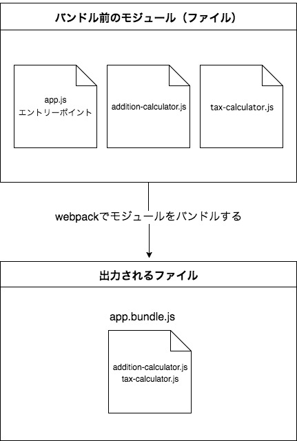
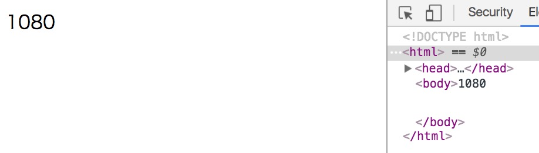

# webpack-v1-tutorial
webpack v1系に対応した記事とサンプルコードです。

# はじめに
webpackに関して説明する機会があったため、それらに関してまとめました。

- 「gulpは使ってるけどwebpackはちょっと...」
- 「webpack.config.jsの中身を見てみたが、何を書いているのか理解できなくて諦めた」
- 「何が便利なのかよくわからない」
- 「別にwebpack使わなくても実装はできるから必要なくない？」

といった人達向けに書いた記事であり、

- webpackに関しての基本情報、利用用途、機能を理解する。
- そもそもモジュールバンドラとは何か、なぜモジュールバンドラを利用するのかを理解する。

ことを目的としています。

## 本記事の前提や注意点

- gulpを触ったことがある人向けの記事なので`npm install`などnpmに関する説明は省きます。
- webpackとモジュールバンドラに関しての記事なのでgulpでwebpackを利用する方法は記載していないです。
- webpackは画像やCSSなどもモジュールにしてまとめることができますが、今回はJavaScriptに焦点を当てた説明をしています。
- 最近[webpack v2.2.0がリリース](https://github.com/webpack/webpack/releases/tag/v2.2.0)されましたが、本記事はv1系を元にした説明をしています。

# webpackとは
モジュールバンドラのこと。

## モジュールバンドラとは
複数のモジュールを1つにまとめたファイルを出力するツールのこと（簡潔に言ってしまえば）。

※出力設定によっては複数のファイルを出力することもあります。

webpack以外に、以下のようなモジュールバンドラが存在する。

- Browserify
- RequireJS

## webpack（モジュールバンドラ）関連の記事でよく利用されている用語

### モジュール
機能ごとに分割されたファイルのこと。
そのため、webpackは複数のファイルをまとめたファイルを出力するツールと認識しておけばとりあえずは問題ない。

### バンドル
まとめられたファイルのこと。バンドルファイルとも言う。そのため、以下の言葉の意味は大体同じ。

- 「バンドルが大きい」 = 「まとめられたファイルのサイズが大きい」
- 「バンドルを生成する」 = 「まとめられたファイルを生成する」

### バンドルする
「まとめる」という意味で使われていることが多い。そのため、以下の言葉の意味は大体同じ。

- 「モジュールをまとめる」 = 「モジュールをバンドルする」

### ビルド
webpackにおいての「ビルド」は「バンドルを出力するまでの一連の処理」という意味で使われていることが多い（気がする）。そのため、以下の言葉の意味は大体同じ。

- 「ビルドする」 = 「バンドルを出力するまでの一連の処理を実行する」
- 「ビルドが遅い」 = 「バンドルを出力するまでの一連の処理が遅い」

# webpackを利用してみる
webpackを利用してモジュールをバンドルしたファイルを出力してみる。

以下は出力までのイメージ図。



## webpackのインストール
以下のコマンドでグローバルインストールできる。

```sh
npm install webpack -g
```

しかし、グローバルインストールは今回webpackを利用したいディレクトリ（プロジェクト）以外の全ての環境に影響を及ぼすため、ローカルインストールをして利用した方が良い。

ローカルインストール方法と、ローカルインストールしたwebpackなどのpackageの実行方法は後述する。

## ディレクトリ構成
今回webpackを利用するディレクトリ構成は以下を前提とする。

```
.
├── package.json
├── public
│   ├── index.html
│   └── js
│       └── bundle.js
├── src
│   └── js
│       ├── app.js
│       └── modules
│           ├── addition-calculator.js
│           └── tax-calculator.js
└── webpack.config.js
```

いくつかのパッケージをローカルインストールするため、`package.json`は以下のコマンドで生成する。

```sh
npm init
```

## webpackのローカルインストール
上記構成のルートで以下のコマンドを実行すればwebpackをローカルインストールできる。

```sh
npm install webpack --save-dev
```

### ローカルインストールしたpackage（今回はwebpack）を実行するためにPATHを通す
現状のままだと、ローカルインストールが成功しても`webpack`コマンドを実行できないため、以下のようにPATHを通す必要がある。

```sh
export PATH=$PATH:./node_modules/.bin
```

※「PATHを通す」が不明な方は以下をご覧ください。

- [PATHを通すとは？ (Mac OS X)](http://qiita.com/soarflat/items/09be6ab9cd91d366bf71)
- [PATHを通すために環境変数の設定を理解する (Mac OS X)](http://qiita.com/soarflat/items/d5015bec37f8a8254380)

## 各ファイルの詳細

### `webpack.config.js`（webpackの設定ファイル）
webpackを利用するためには`webpack.config.js`というファイルに設定を記述する必要がある。

今回の設定は以下の通り。

```js:webpack.config.js
module.exports = {
  // エントリーポイントの設定
  entry: './src/js/app.js',
  // 出力の設定
  output: {
    // 出力するファイル名
    filename: 'bundle.js',
    // 出力先のパス
    path: './public/js'
  }
};
```

各項目の詳細は以下の通り。

#### `entry`
エントリーポイントの設定。複数設定することも可能。

エントリーポイントとはモジュール間の依存関係の解析を開始する地点のこと。各モジュールを読み込んでメインの処理をするJavaScriptファイルだと認識しておけば良い。

#### `output`
出力の設定。
出力するファイル名や出力先のパスを指定する。

### `app.js`（エントリーポイント）
2つのアイテムの価格を合算し、消費税込みの価格を出力をするエントリーポイント。

`require`というメソッドでモジュールを読み込んで利用できるため、`addition-calculator.js`と`tax-calculator.js`モジュールを`require`で読み込んで利用している。

```js:src/js/app.js
var additionCalculator = require('./modules/addition-calculator');
var taxCalculator = require('./modules/tax-calculator');

var item1Price = 400;
var item2Price = 600;
var totalPrice = additionCalculator(item1Price, item2Price);
var tax = 1.08;
var priceIncludeTax = taxCalculator(totalPrice, tax);

console.log(priceIncludeTax);
```

### `addition-calculator.js`（モジュール）
引数の`number1`と`number2`を合算して返すモジュール。

`require`で読み込んで利用するためには、モジュールを定義する必要がある。そのため`module.exports`で`additionCalculator`をモジュールとして定義している。

```js:src/js/modules/addition-calculator.js
var additionCalculator = function(number1 ,number2) {
  return number1 + number2;
};

module.exports = additionCalculator;
```

### `tax-calculator.js`（モジュール）
引数`price`と`tax`を乗算して返すモジュール。

`addition-calculator.js`と同様に`module.exports`で`taxCalculator`をモジュールとして定義している。

```js:src/js/modules/tax-calculator.js
var taxCalculator = function(price ,tax) {
  return Math.round(price * tax);
};

module.exports = taxCalculator;
```

## `webpack`コマンドでバンドルされたファイルを出力
上記構成の`webpack.config.js`が存在する階層で`webpack`コマンドを実行すれば、バンドルされたファイルが出力される。

今回の設定だと`bundle.js`という名前のファイルが`public/js/`に出力される。

```sh
webpack

# 以下のような実行結果が出力される。
Hash: 3c08e31bb2d166f3a300
Version: webpack 1.14.0
Time: 50ms
    Asset     Size  Chunks             Chunk Names
bundle.js  2.19 kB       0  [emitted]  main
   [0] ./src/js/app.js 454 bytes {0} [built]
   [1] ./src/js/modules/addition-calculator.js 123 bytes {0} [built]
   [2] ./src/js/modules/tax-calculator.js 113 bytes {0} [built]
```

出力された`bundle.js`の記述は以下のようになっている（一部記述省略）。

```js:public/js/bundle.js
/******/ ([
/* 0 */
/***/ function(module, exports, __webpack_require__) {

	var additionCalculator = __webpack_require__(1);
	var taxCalculator = __webpack_require__(2);

	var item1Price = 400;
	var item2Price = 600;
	var totalPrice = additionCalculator(item1Price, item2Price);
	var tax = 1.08;
	var priceIncludeTax = taxCalculator(totalPrice, tax);

	console.log(priceIncludeTax);

/***/ },
/* 1 */
/***/ function(module, exports) {

	var additionCalculator = function(number1 ,number2) {
	  return number1 + number2;
	};

	module.exports = additionCalculator;

/***/ },
/* 2 */
/***/ function(module, exports) {

	var taxCalculator = function(price ,tax) {
	  return Math.round(price * tax);
	};

	module.exports = taxCalculator;

/***/ }
/******/ ])
```

モジュールがバンドルされていることがわかる。

また、以下のような`bundle.js`を読み込んでいるhtmlファイルをブラウザで開き、コンソールを確認してみると正常に動作していることがわかる。

```html
<!DOCTYPE html>
<html>
<head>
    <meta charset="utf-8">
    <title>webpack tutorial</title>
</head>
<body>
<script src="js/bundle.js"></script>
</body>
</html>
```


### モジュールがバンドルされたファイルを出力できたが
これだけだとwebpack（モジュールバンドラ）の何が良いのかがわからないため、メリットやなぜ利用するのかを説明していく。

# なぜwebpack（モジュールバンドラ）を利用するのか
- 機能ごとにファイルを分割（モジュール化）する開発ができるから
- 自分が作成したモジュールだけではなく、外部モジュール（npmなどでインストールできるパッケージなど）も利用できるから
- リクエスト数を減らせるから
- 依存関係を解決したファイルを出力できるから

などモジュールの開発、再利用、バンドルなどが魅力的だから。

## 機能ごとにファイルを分割（モジュール化）する開発ができる
ファイルを分割（モジュール化）する開発には以下のようなメリットがある。

- コードが見やすくなる（可読性の向上）
- 開発作業の分担やテストがし易くなる
- 名前空間を生成できる（変数の競合やグローバル汚染を防ぐ）
- モジュールの保守性を高められる
- モジュールの再利用性を高められる

### コードが見やすくなる（可読性の向上）
1つのファイルに複数の機能が書かれたコードよりも、1つのファイルに1つの機能が書かれたコードの方が見やすい。

### 開発作業の分担やテストが容易になる
1つのファイルに複数の機能が集中している場合、機能毎に担当を分けるなどの作業分担がし辛いし、テストもし辛い。

機能ごとにファイルを分割していれば、作業分担やテストがし易い。

### 名前空間を生成できる（変数の競合やグローバル汚染を防ぐ）
モジュール毎に名前空間を割り当てれば、変数の競合やグローバル汚染を防げる。

### モジュールの保守性を高められる
モジュールは他のコードとの依存性が少なくあるべきなので、しっかり設計をすれば変更や拡張がしやすくなる。

ファイルを分割すればモジュールになるわけではなく、あるモジュールを修正するために他のコードに大きな影響を与える場合、それはモジュールとは言えないため注意。

### モジュールの再利用性を高められる
汎用性の高いモジュールを開発すれば再利用できて便利。

コードをコピペで再利用する場合だと、修正時にコピペしたファイルを全て修正する必要があるが、モジュールとしてファイルを分割しておけば1つのファイルを修正するだけで済む。

## 自分が作成したモジュールだけではなく、外部モジュール（npmなどでインストールできるパッケージなど）も利用できる
試しに外部モジュールのjQueryを利用してみる。まずは`jquery`をローカルインストールする。

```sh
npm install jquery --save
```

インストールしたパッケージは他のモジュール同様、`require`で読み込みモジュールとして利用できる。

```js:src/js/app.js
var $ = require('jquery');
var additionCalculator = require('./modules/addition-calculator');
var taxCalculator = require('./modules/tax-calculator');

var item1Price = 400;
var item2Price = 600;
var totalPrice = additionCalculator(item1Price, item2Price);
var tax = 1.08;
var priceIncludeTax = taxCalculator(totalPrice, tax);

console.log(priceIncludeTax);
$('body').html(priceIncludeTax);
```

上記の状態で`webpack`コマンドを実行すると`jquery`もバンドルされたファイルが出力される。

```sh
webpack

# 以下のような実行結果が出力される。
Hash: 2108cd93044f8b36f3f5
Version: webpack 1.14.0
Time: 354ms
    Asset    Size  Chunks             Chunk Names
bundle.js  279 kB       0  [emitted]  main
   [0] ./src/js/app.js 791 bytes {0} [built]
   [2] ./src/js/modules/addition-calculator.js 225 bytes {0} [built]
   [3] ./src/js/modules/tax-calculator.js 210 bytes {0} [built]
    + 1 hidden modules
```

`bundle.js`を読み込んでいるhtmlファイルをブラウザで確認してみると、jQueryもバンドルされて正常に動作していることがわかる。



外部モジュールを利用できたが、

- 「わざわざファイルをまとめずに、scriptタグでjQuery読み込めば良いのでは？」

と思った方は多々いると思うのし、確かにちょっとしたコードを書く程度ならそちらの方が楽。しかし、後述するメリットを考慮するとjQueryのような外部モジュールもバンドルした方が良い時もある。

## リクエスト数を減らせる
以下はjQueryを読み込み、jQueryに依存している`app.js`を読み込んでいるhtmlファイルだと想定する。

```html
<!DOCTYPE html>
<html>
<head>
    <meta charset="utf-8">
    <title>webpack tutorial</title>
</head>
<body>
<script src="https://code.jquery.com/jquery-3.1.1.min.js"></script>
<script src="js/app.js"></script>
</body>
</html>
```

上記のようなファイルは以下の懸念点がある。

- 現在は1つのライブラリだけ読み込んでいるが、必要なライブラリが増えてリクエスト数が増える可能性がある（リクエスト数の増加はパフォーマンス上良くない）。

webpackを利用すればファイルをバンドルできるため、リクエスト数を減らせる。

```html
<!DOCTYPE html>
<html>
<head>
    <meta charset="utf-8">
    <title>webpack tutorial</title>
</head>
<body>
<!-- jQueryもバンドルされたファイル -->
<script src="js/bundle.js"></script>
</body>
</html>
```

しかし、全てのファイルを1つにバンドルする場合、以下の懸念点が考えられる。

- ファイルサイズが非常に大きくなり読み込み時間がかかる。

バンドルしたファイルを分割して出力したり、それらのファイルを非同期読み込みするなどの機能があるのでそれらを利用する。

- キャッシュを活用できない。

ライブラリは頻繁に変更しないファイルのため、キャッシュを活用すべきだが、全てのファイルを1つにバンドルするとそれができない。

そのため、頻繁に変更するファイルのバンドルと、ライブラリ群をまとめたバンドルは別にして出力する（CommonsChunkPluginというプラグインが必要）。

## 依存関係を解決したファイルを出力できる

以下はjQueryを読み込み、jQueryに依存している`app.js`を読み込んでいるhtmlファイルだと想定する。
`app.js`はjQueryに依存しているため、jQueryを読み込む前に`app.js`を読み込むと動かない。

```html
<!DOCTYPE html>
<html>
<head>
    <meta charset="utf-8">
    <title>webpack tutorial</title>
</head>
<body>
<!-- app.jsはjQueryに依存しているため、jQueryを読み込んだ後に読み込む必要がある。 -->
<script src="https://code.jquery.com/jquery-3.1.1.min.js"></script>
<script src="js/app.js"></script>
</body>
</html>
```

上記のようなファイルは以下の懸念点がある。

- 依存しているライブラリが1つだけなら良いが、依存が増えれば増えるほど依存関係がわかり辛くなる。
- それぞれのファイルの依存関係をすぐに理解できるのは作業をした人間のみであり、別の作業者が依存関係をすぐに理解するのは困難。
- 依存関係が複雑になればなるほど、迂闊にスクリプトの読み込み順を変更したり本来不要なファイルを削除できなくなる。

webpackを利用すれば依存関係を解決してファイルをバンドルするため、スクリプトの順番を考慮する必要はなくなり依存関係に悩まされる可能性は低くなる。

```html
<!DOCTYPE html>
<html>
<head>
    <meta charset="utf-8">
    <title>webpack tutorial</title>
</head>
<body>
<!-- 依存関係を解決してまとめられたファイル -->
<script src="js/bundle.js"></script>
</body>
</html>
```

また、依存するパッケージ（モジュール）を`package.json`に明記し、それらの利用を促せば以下のような事態に陥る可能性は低くなる。

- 理由もなく作業者によって利用するライブラリのバージョンが異なる。
- 1ページに同じライブラリが複数読み込まれてしまっている。
- 同じライブラリが様々なディレクトリに存在する。誰がどこで何のために利用しているのかわからないため迂闊に消せない。

## webpack（モジュールバンドラ）の使いどころ
上記のメリットや機能が必要に感じたり、魅了に感じる状況であれば利用すべき。

逆にすぐに捨てるコードや2〜30行程度のコンパクトなコードを書く程度なら必要ないと思う。

webpackは非常に多くの機能が存在し、細かい設定ができるため`webpack.config.js`の内容を理解せずにコピペして利用するはやめた方が良い。利用用途に合わせて`webpack.config.js`を用意するべき。

とは言え、全ての機能を完全に理解するのは困難なので、頻繁に利用しそうな機能を紹介していく。

# webpackの様々な機能

## watchモード
ファイルを監視して変更があったらビルドを再実行する機能のこと。

watchモードでは基本的にキャッシュが有効になるため、ビルド時間が短くなる。

オプションを指定して`webpack`コマンドを実行するか、`webpack.config.js`に設定を記述することで利用できる。

```sh
webpack --watch
```

```js
module.exports = {
  // watchモードを有効にする
  watch: true,
  entry: "./app.js",
  output: {
    filename: "bundle.js",
    path: './public/js'
  }
}
```

## ローダー
画像やCSSなどのJavaScript以外のファイルをJavaScriptで扱えるように変換する機能のこと。

TypeScriptをJavaScriptに変換したり画像をDataURLに変換するなど、ローダーによって変換処理は様々。

今回はES2015（ES6）を変換する`babel-loader`を利用してみる。

ローダーを利用するためにはそれに応じたパッケージをインストールしておく必要がある。
`babel-loader`を利用したい場合は以下のパッケージをインストールする。

```
npm install babel-loader babel-core babel-preset-es2015 --save-dev
```

インストール後、`webpack.config.js`に`babel-loader`の設定を追加する。

```js:webpack.config.js
module.exports = {
  // エントリーポイントの設定
  entry: './src/js/app.js',
  // 出力の設定
  output: {
    // 出力するファイル名
    filename: 'bundle.js',
    // 出力先のパス
    path: './public/js'
  },
  // ローダーの設定
  module: {
    loaders: [{
      // ローダーの対象ファイル
      test: /\.js$/,
      // ローダーの対象から外すディレクトリ
      exclude: /node_modules/,
      // 利用するローダー
      loader: 'babel-loader?presets[]=es2015'
    }]
  }
};
```

上記の設定で`webpack`コマンドを実行すれば、以下のようなES2015（ES6）のコードをどのブラウザでも動くように変換してくれる。

```js:src/js/app.js
import $ from 'jquery';
import additionCalculator from './modules/addition-calculator';
import taxCalculator from './modules/tax-calculator';

const item1Price = 400;
const item2Price = 600;
const totalPrice = additionCalculator(item1Price, item2Price);
const tax = 1.08;
const priceIncludeTax = taxCalculator(totalPrice, tax);

console.log(priceIncludeTax);
$('body').html(priceIncludeTax);
```

```js:src/js/modules/addition-calculator.js
export default function additionCalculator(number1 ,number2) {
  return number1 + number2;
}
```

```js:src/js/modules/tax-calculator.js
export default function taxCalculator(price ,tax) {
  return Math.round(price * tax);
}
```

## プラグイン
モジュールのバンドル時に実行される様々な処理のこと。

今回はいくつかプラグインを追加してみる。

プラグインを利用するためには`webpack.config.js`上で`webpack`を読み込む必要があるためローカルインストールする。

```sh
npm install webpack --save-dev
```

### `UglifyJsPlugin`
JavaScriptを圧縮するプラグイン。
以下は`webpack.config.js`に`UglifyJsPlugin`を追加したもの。

```js:webpack.config.js
// UglifyJsPluginなどのプラグインを利用するためにwebpackを読み込んでおく必要がある。
var webpack = require('webpack');

module.exports = {
  // エントリーポイントの設定
  entry: './src/js/app.js',
  // 出力の設定
  output: {
    // 出力するファイル名
    filename: 'bundle.js',
    // 出力先のパス
    path: './public/js'
  },
  // ローダーの設定
  module: {
    loaders: [{
      // ローダーの対象ファイル
      test: /\.js$/,
      // ローダーの対象から外すディレクトリ
      exclude: /node_modules/,
      // 利用するローダー
      loader: 'babel-loader?presets[]=es2015'
    }]
  },
  // プラグインの設定
  plugins: [
    new webpack.optimize.UglifyJsPlugin({
      // 圧縮に関する設定
      compress: {
        // 警告を出力するかどうか
        warnings: false,
      }
    })
  ]
};
```

上記の設定で`webpack`コマンドを実行すれば、圧縮されたファイル（圧縮前は278KB）が出力される。

```sh
webpack

# 以下のような実行結果が出力される。
Hash: 594fc01bc8b245aaf946
Version: webpack 1.14.0
Time: 2107ms
    Asset     Size  Chunks             Chunk Names
bundle.js  88.4 kB       0  [emitted]  main
    + 4 hidden modules
```

プラグインを利用せず、以下のコマンドでも圧縮したファイルが出力される。

```
webpack -p
```

ビルドする度にファイルが圧縮されるのは好ましくない場合はコマンドで実行する。

### `ProvidePlugin`
指定したモジュールをすべてのファイル（モジュール）の変数として利用可能にするプラグイン。

利用可能にしたモジュールは`require`メソッドなどで読み込む必要がなくなる。

以下は`webpack.config.js`に`ProvidePlugin`を追加したもの。

```js:webpack.config.js
// UglifyJsPluginなどのプラグインを利用するためにwebpackを読み込んでおく必要がある。
var webpack = require('webpack');

module.exports = {
  // エントリーポイントの設定
  entry: './src/js/app.js',
  // 出力の設定
  output: {
    // 出力するファイル名
    filename: 'bundle.js',
    // 出力先のパス
    path: './public/js'
  },
  // ローダーの設定
  module: {
    loaders: [{
      // ローダーの対象ファイル
      test: /\.js$/,
      // ローダーの対象から外すディレクトリ
      exclude: /node_modules/,
      // 利用するローダー
      loader: 'babel-loader?presets[]=es2015'
    }]
  },
  // プラグインの設定
  plugins: [
    new webpack.optimize.UglifyJsPlugin({
      // 圧縮に関する設定
      compress: {
        // 警告を出力するかどうか
        warnings: false,
      }
    }),
    new webpack.ProvidePlugin({
      $: 'jquery'
    })
  ]
};
```

`jquery`を全てのモジュール上で変数`$`として利用できるようにしたため、`app.js`の`jquery`を読み込む記述を消しても正常に動作する。

```js:src/js/app.js
import additionCalculator from './modules/addition-calculator';
import taxCalculator from './modules/tax-calculator';

const item1Price = 400;
const item2Price = 600;
const totalPrice = additionCalculator(item1Price, item2Price);
const tax = 1.08;
const priceIncludeTax = taxCalculator(totalPrice, tax);

console.log(priceIncludeTax);
$('body').html(priceIncludeTax);
```

### `CommonsChunkPlugin`
複数のエントリーポイント間で利用できる共通のモジュールをバンドルしたファイルを出力するプラグイン。

※詳細は別の記事に書きましたので、こちらを参考にしてください。
[webpackのCommonsChunkPluginの使い方、使い所](http://qiita.com/soarflat/items/f8212434c4c3cb8ee00d)

# 終わり
今後もフロントエンド開発は大規模かつ複雑になると思うのでモジュール化を考慮した開発は普段から意識しておいて損はないです。

とは言え、いきなり自分でモジュールを開発するのも難しいと思うため、まずは外部モジュールの利用から始めてみると良いと思います。

webpack自体の機能はほとんど紹介できていないため、興味を持った方やより深く知りたい方はドキュメントを見ることをお勧めします。

v1系を元にした説明をしておいてなんですが、[v2系のドキュメント](https://webpack.js.org/)の方が綺麗にまとまっていて見やすいです。
